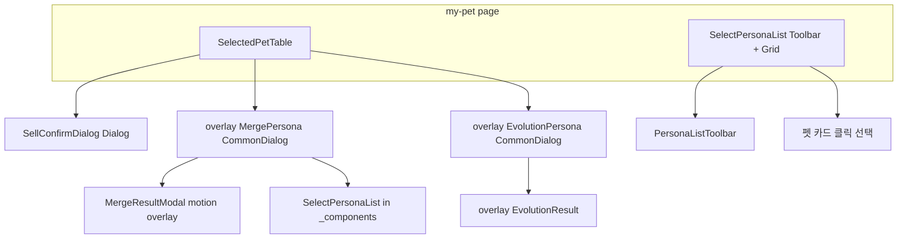

# my-pet 페이지에서 일어날 수 있는 동작

대상: [`page.tsx`](./page.tsx)가 렌더하는 트리 (`SelectedPetTable`, [`../PersonaList.tsx`의 `SelectPersonaList`](../PersonaList.tsx)).

---

## 1. 페이지 본문 (`page.tsx`)

| 동작      | 설명                                                                                           |
| --------- | ---------------------------------------------------------------------------------------------- |
| 초기 선택 | `initSelectPersonas`: 페르소나 목록이 로드되면 아직 선택이 없을 때 **첫 번째 펫을 자동 선택**. |
| 스크롤    | 펫 그리드 영역은 `ScrollArea`로 **세로 스크롤**.                                               |
| 하단 문구 | `sell-to-other` 번역 문자열이 **5초 후 fade-in** (클릭 동작 없음).                             |

---

## 2. 상단 행 (`SelectedPetTable.tsx`)

**전제:** `currentPersona`가 있을 때만 펫 정보·버튼이 보입니다.

| 동작                | UI / 메커니즘                                                                                                                                                                                    | 결과                                                                                                                     |
| ------------------- | ------------------------------------------------------------------------------------------------------------------------------------------------------------------------------------------------ | ------------------------------------------------------------------------------------------------------------------------ |
| **판매 (100P)**     | 로컬 스토리지 `LOCAL_STORAGE_KEY.isDoNotShowAgain`이 true면 확인 없이 `dropPet` API; 아니면 **`Dialog`** (`SellConfirmDialog`) 열림. 확인 시 다시 `dropPet`, 체크 시 “다시 보지 않기” 저장.           | 성공 시 `toast.success`, `userQueries` 무효화, 판매 대상 id 초기화, `reset()`으로 상단 선택 해제. 실패 시 `toast.error`. |
| **합성(merge)**     | `overlay-kit`으로 [`MergePersona`](./(merge)/MergePersona.tsx) (`CommonDialog`, large).                                                                                                | 아래 3절 참고.                                                                                                           |
| **진화(evolution)** | `currentPersona.isEvolutionable`일 때만 버튼 표시. `overlay-kit`으로 [`EvolutionPersona`](./(evolution)/EvolutionPersona.tsx) (`CommonDialog`, large). | 아래 4절 참고.                                                                                                           |

**판매 확인 모달:** 제목/설명, “다시 보지 않기” `Checkbox`, 닫기/확인 버튼, `onOpenChange`로 닫기.

---

## 3. 합성 플로우 (`MergePersona`)

| 동작            | 설명                                                                                                                                                                                                                              |
| --------------- | --------------------------------------------------------------------------------------------------------------------------------------------------------------------------------------------------------------------------------- |
| 다이얼로그 닫기 | 푸터 **취소** 또는 `CommonDialog`의 닫기 동작.                                                                                                                                                                                    |
| 재료 펫 선택    | 내부 [`_components/SelectPersonaList`](./_components/SelectPersonaList.tsx): 검색·등급·티어·정렬·필터 초기화(`PersonaListToolbar`). 펫 클릭 시 타겟과 같으면 재료 해제, 다르면 재료로 설정. |
| 합성 실행       | 타겟+재료 모두 있을 때만 활성화. `useMergePersonaLevelByToken` mutation. 진행 중 **`SpinningLoader`** 표시.                                                                                                                         |
| 성공 후         | `MergeResultModal`: 커스텀 **전체 화면 dim + 중앙 카드(framer-motion)**, 배경/X로 닫기. `userQueries.allPersonasKey` 무효화, 결과로 타겟 페르소나 상태 갱신.                                                                      |

---

## 4. 진화 플로우 (`EvolutionPersona`)

| 동작       | 설명                                                                                                                                                          |
| ---------- | ------------------------------------------------------------------------------------------------------------------------------------------------------------- |
| 다이얼로그 | 프리뷰(`EvolutionPreview`) + **진화** 버튼 한 번.                                                                                                             |
| 진행 중    | `SpinningLoader`.                                                                                                                                             |
| 성공 시    | `evolutionPersona` mutation `onSuccess`: **`overlay.open(EvolutionResult)`** (별도 결과 오버레이), **부모 `CommonDialog`는 `onClose()`**, 페르소나 쿼리 무효화. |

---

## 5. 하단 펫 목록 (`SelectPersonaList` in `PersonaList.tsx`)

| 동작          | 설명                                                                                                                                                                                              |
| ------------- | ------------------------------------------------------------------------------------------------------------------------------------------------------------------------------------------------- |
| **툴바**      | `PersonaListToolbar` (`@/components/PersonaListToolbar`): 검색(`SearchBar`), 등급·티어 칩, **진화 가능만** 토글(`showEvolvableFilter`), 정렬, 조건 있을 때 **초기화(`RotateCcw`)**. |
| **그리드**    | `MemoizedBannerPersonaItem` (`@/components/PersonaItem`) 클릭 → `onSelectPersona` → 페이지 state **`selectPersona` 갱신** (상단 테이블에 반영). `isSpecialEffect`로 표시 옵션.            |
| **빈 목록**   | 필터 결과 0건 시 `Mypage.Filter.no-results` 문구.                                                                                                                                                 |
| **로딩/에러** | Suspense 스켈레톤; ErrorBoundary 시 `error` 텍스트.                                                                                                                                               |

데이터: `useSuspenseQuery(userQueries.allPersonasOptions(name))` — 로그인 사용자 이름 기준 전체 페르소나.

---

## 6. 요약: 모달/오버레이

1. **Radix `Dialog`**: 판매 확인 (`SellConfirmDialog`).
2. **`CommonDialog` (overlay-kit)**: 합성(`MergePersona`), 진화(`EvolutionPersona`).
3. **`overlay-kit` 추가 레이어**: 진화 성공 시 `EvolutionResult`.
4. **`MergeResultModal`**: 합성 성공 후 커스텀 dim 레이어.

이 문서는 해당 페이지에서 코드 기준으로 일어날 수 있는 사용자 동작을 정리한 것입니다.
